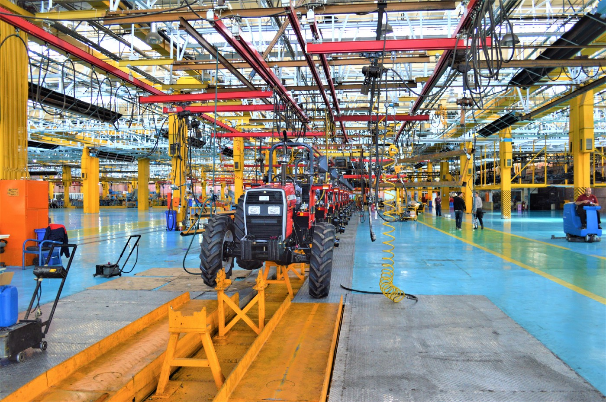
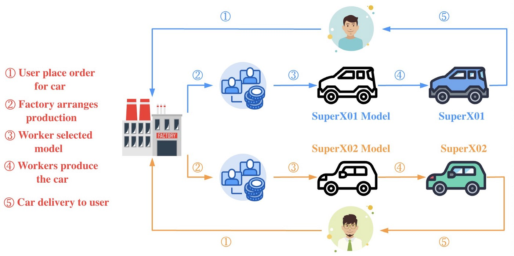
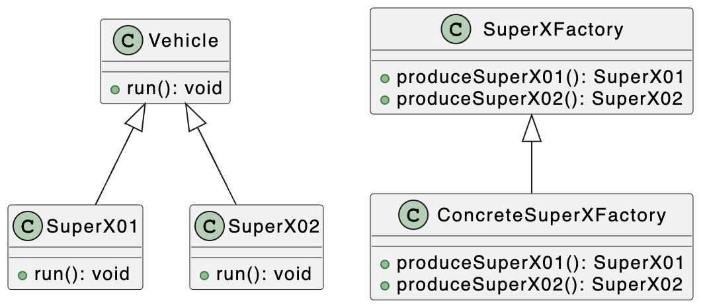
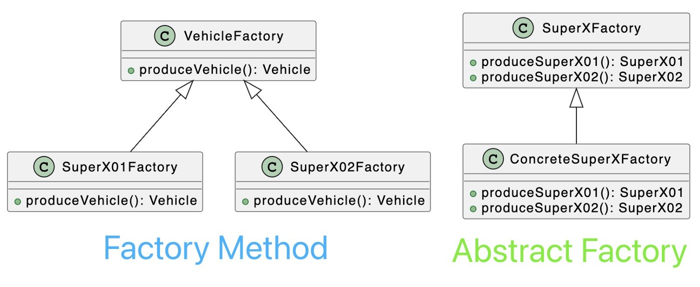

# Паттерны проектирования: паттерн Абстрактной фабрики в TypeScript

### Освойте паттерн Абстрактной фабрики и создавайте объекты с легкостью.

[Источник](https://medium.com/javascript-in-plain-english/design-patterns-abstract-factory-pattern-in-typescript-84cd7b0029649)


<br />

Добро пожаловать в серию **«Паттерны проектирования в TypeScript»**, в которой будет представлен ряд полезных паттернов проектирования в веб-разработке с использованием TypeScript.

Вот ссылки на опубликованные статьи:

- [Паттерн Стратегия в TypeScript](https://javascript.plainenglish.io/design-patterns-strategy-pattern-in-typescript-54eda9b40f09)
- [Паттерн Цепочка Обязанностей в TypeScript](https://javascript.plainenglish.io/design-patterns-chain-of-responsibility-pattern-in-typescript-dba6bdffe456)
- [Паттерн Наблюдатель в TypeScript](https://javascript.plainenglish.io/design-patterns-observer-pattern-in-typescript-f6589f1ce4fc)
- [Паттерн Шаблонного метода в TypeScript](https://javascript.plainenglish.io/design-patterns-template-method-pattern-in-typescript-ce0c8b158985)
- [Паттерн Адаптер в TypeScript](https://javascript.plainenglish.io/design-patterns-adapter-pattern-in-typescript-4b7ad3c1c234)
- [Паттерн Фабричного метода в TypeScript](https://javascript.plainenglish.io/design-patterns-factory-method-pattern-in-typescript-c4c3047a6289)
- [Паттерн Абстрактной фабрики в TypeScript](https://javascript.plainenglish.io/design-patterns-abstract-factory-pattern-in-typescript-84cd7b002964)

Паттерны проектирования очень важны для веб-разработчиков, которые освоив паттерны становятся способными улучшить качество написания кода. В этой статье я буду использовать **TypeScript**, чтобы рассказать о **паттерне Абстрактной фабрики**.

Паттерн Абстрактной фабрики предоставляет интерфейс для создания партий связанных или взаимозависимых объектов без определения в ходе создания их конкретных свойств (классов).

В [паттерне Фабричный метод](https://javascript.plainenglish.io/design-patterns-factory-method-pattern-in-typescript-c4c3047a6289) конкретная фабрика отвечает за производство конкретных продуктов, каждая конкретная фабрика соответствует определенному продукту, и метод у каждой фабрики также уникален. Как правило, в конкретной фабрике существует только один метод создания объектов или группа перезагружаемых методов, но они предназначены только для этой конкретной фабрики. Но иногда нам нужна фабрика, которая может поставлять несколько продуктов, а не один продукт.


<br />

На картинке выше я смоделировал процесс покупки автомобиля пользователем. Bytefer заказал SuperX01 на заводе SuperX, и завод изготовил его по модели, соответствующей SuperX01, и доставил его bytefer после завершения производства. Chris1993 заказал SuperX02 на той же фабрике SuperX, и этот же завод изготовил его по образцу, соответствующему SuperX02, и доставила chris1993 после завершения производства.

Давайте посмотрим, как использовать абстрактную фабрику для описания процесса производства определенной модели автомобиля на автомобильном заводе.

Чтобы лучше понять код, давайте сначала изучим соответствующую диаграмму UML:


<br />

Паттерн Абстрактная фабрика включает следующие роли:

- **Product (Vehicle)**: абстрактный продукт
- **Concrete Product (SuperX01)**: конкретный продукт
- **Factory (VehicleFactory)**: абстрактная фабрика
- **ConcreteFactory(SuperX01Factory)**: конкретная фабрика

Определим абстрактный класс `Vehicle` и два его подкласса `SuperX01` и `SuperX02` для конкретных двух различных типов транспортных средств.

```
abstract class Vehicle {
  abstract run(): void;
}
class SuperX01 extends Vehicle {
  run(): void {
    console.log("SuperX01 start");
  }
}
class SuperX02 extends Vehicle {
  run(): void {
    console.log("SuperX02 start");
  }
}
```

Теперь определим класс `SuperXFactory` для представления фабрики по производству автомобилей. Эта абстрактная фабрика содержит абстрактные методы для производства моделей автомобилей SuperX01 и SuperX02.

```
abstract class SuperXFactory {
  abstract produceSuperX01(): SuperX01;
  abstract produceSuperX02(): SuperX02;
}
```

На основе абстрактного класса `SuperXFactory` мы определяем заводской класс `ConcreteSuperXFactory` для производства моделей автомобилей **SuperX01** и **SuperX02**:

```
class ConcreteSuperXFactory extends SuperXFactory {
  produceSuperX01(): SuperX01 {
    return new SuperX01();
  }
  produceSuperX02(): SuperX02 {
    return new SuperX02();
  }
}
```

После создания заводского класса `ConcreteSuperXFactory` мы можем «запустить» производство транспортных средств:

```
const superXFactory = new ConcreteSuperXFactory();
const superX01 = superXFactory.produceSuperX01();
const superX02 = superXFactory.produceSuperX02();
superX01.run();
superX02.run();
```

В итоге выполнения кода, на терминал можно будет получить следующий результат:

```
SuperX01 start
SuperX02 start
```

Мы представили [паттерн Фабричного метода](https://javascript.plainenglish.io/design-patterns-factory-method-pattern-in-typescript-c4c3047a6289) в предыдущей статье, так в чем же разница между ним и паттерном Абстрактной фабрики?

Самая большая разница между паттерном Абстрактной фабрики и [паттерном Фабричного метода](https://javascript.plainenglish.io/design-patterns-factory-method-pattern-in-typescript-c4c3047a6289) заключается в том, что **паттерн Фабричного метода нацелен на уникальный (иерархический) продукт. А паттерн Абстрактной фабрики должен уметь обращаться с несколькими видами продуктов, и даже структура Абстрактной фабрики должна соответствовать свойствам нескольких различных продуктов**.


<br />
Переходя к созданию объектов как продуктов - когда структура абстрактной фабрики сможет создавать все объекты в семействе продуктов, принадлежащих к различным типам, паттерн Абстрактной фабрики станет проще и эффективнее, чем использование паттерна Фабричного метода.
 <br />

Если у вас есть какие-либо вопросы, пожалуйста, пишите мне. В дальнейшем я продолжу знакомить вас с другими паттернами, и если вам интересно, подпишитесь на меня в Medium или Twitter.
