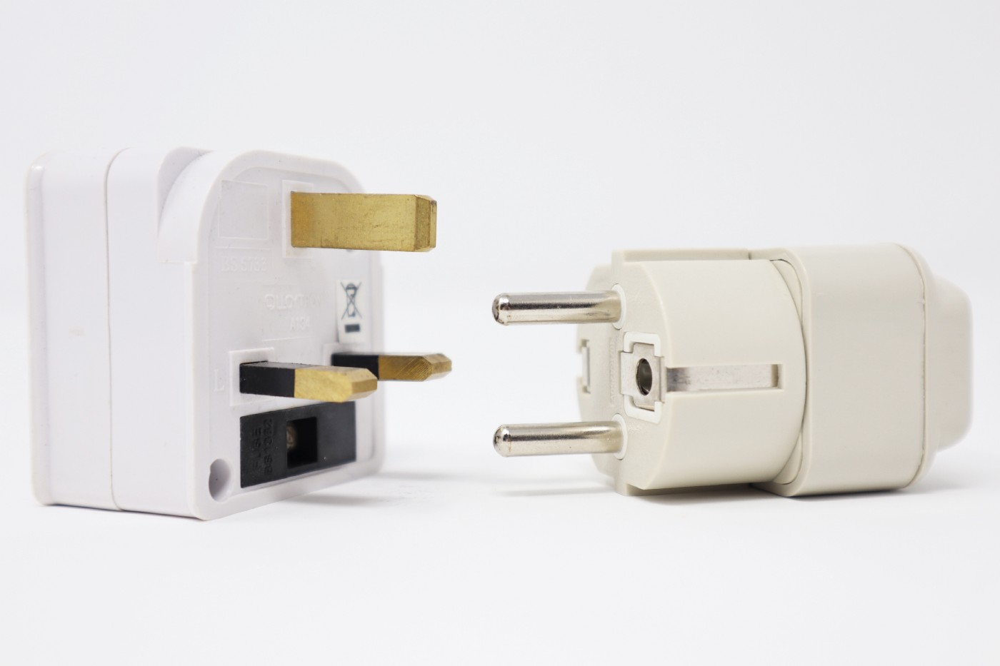
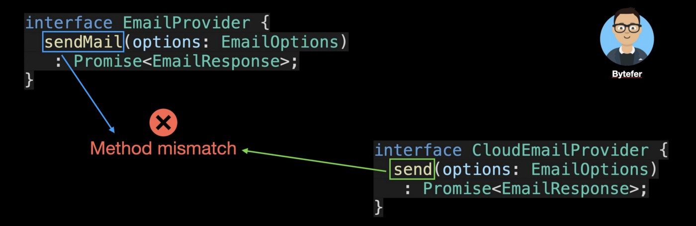

# Паттерны проектирования: паттерн Адаптер в TypeScript

### Простое решение проблем несовместимости интерфейсов с помощью паттерна Адаптер

[Источник](https://medium.com/javascript-in-plain-english/design-patterns-adapter-pattern-in-typescript-4b7ad3c1c234)


<br />

Добро пожаловать в серию **«Паттерны проектирования в TypeScript»**, в которой будет представлен ряд полезных паттернов проектирования в веб-разработке с использованием TypeScript.

Вот ссылки на опубликованные статьи:

- [Паттерн Стратегия в TypeScript](https://javascript.plainenglish.io/design-patterns-strategy-pattern-in-typescript-54eda9b40f09)
- [Паттерн Цепочка Обязанностей в TypeScript](https://javascript.plainenglish.io/design-patterns-chain-of-responsibility-pattern-in-typescript-dba6bdffe456)
- [Паттерн Наблюдатель в TypeScript](https://javascript.plainenglish.io/design-patterns-observer-pattern-in-typescript-f6589f1ce4fc)
- [Паттерн Шаблонного метода в TypeScript](https://javascript.plainenglish.io/design-patterns-template-method-pattern-in-typescript-ce0c8b158985)
- [Паттерн Адаптер в TypeScript](https://javascript.plainenglish.io/design-patterns-adapter-pattern-in-typescript-4b7ad3c1c234)
- [Паттерн Фабричного метода в TypeScript](https://javascript.plainenglish.io/design-patterns-factory-method-pattern-in-typescript-c4c3047a6289)
- [Паттерн Абстрактной фабрики в TypeScript](https://javascript.plainenglish.io/design-patterns-abstract-factory-pattern-in-typescript-84cd7b002964)

Паттерны проектирования очень важны для веб-разработчиков, которые освоив паттерны становятся способными улучшить качество написания кода. В этой статье я буду использовать **TypeScript**, чтобы рассказать о **паттерне Адаптер**.

Для Интернета электронная почта является очень часто используемым сервисом. На платформе Node.js мы можем использовать модуль [nodemailer](https://github.com/nodemailer/nodemailer) и с помощью него легко реализовать функцию отправки электронных писем. После установки модуля [nodemailer](https://github.com/nodemailer/nodemailer) для отправки электронных писем достаточно выполнить следующий код:

```
let transporter = nodemailer.createTransport(transport[, defaults]);
transporter.sendMail(data[, callback])

```

Чтобы избежать привязки сервиса электронной почты к конкретному провайдеру услуг, перед разработкой почтового сервиса мы сначала определим интерфейс, связанный с почтовым провайдером:

```
interface EmailProvider {
  sendMail(options: EmailOptions): Promise<EmailResponse>;
}
interface EmailOptions {
  to: string | string[];
  subject: string;
  html: string;
  from?: string;
  text?: string;
}
interface EmailResponse {}
```

С помощью этих интерфейсов мы можем легко создавать новые почтовые сервисы:

```
class EmailService {
  constructor(public emailProvider: EmailProvider) {}
  async sendMail(options: EmailOptions): Promise<EmailResponse> {
    const result = await this.emailProvider.sendMail(options);
    return result;
  }
}
```

В обычной ситуации это решение не представляет большой проблемы в реализации. Но однажды вам может понадобится использовать стороннего поставщика облачных услуг электронной почты, например, **sendgrid** или **mailersend** и т.д. В их SDK вы найдете название метода, используемого для отправки почты - `send`. Пойдем дальше и определим интерфейс `CloudEmailProvider`:

```
interface CloudEmailProvider {
  send(options: EmailOptions): Promise<EmailResponse>;
}
```

Сравнивая его и ранее созданный интерфейс `EmailProvider`, вы обнаружите следующую проблему:


<br />

Очевидно, что использовать интерфейс `EmailService` для доступа к сторонним облачным службам электронной почты невозможно из-за несовпадения наименования методов. Для решения этой проблемы существует множество способов, но мы попробуем использовать паттерн Адаптер для этой задачи.

Цель паттерна Адаптер — это позволить двум объектам, которые не работают вместе из-за несоответствия интерфейсов, начать работать вместе. Это как клей, изменяющий свойства двух разных предметов, чтобы они могли работать вместе. Паттерн Адаптер подразумевает следующие роли:

- **Client(EmailService)**: это объект, который должен использовать целевой интерфейс;
- **Target(EmailProvider)**: определяет интерфейс, ожидаемый Client;
- **Adapter(CloudEmailAdapter)**: адаптирует интерфейс Adaptee к интерфейсу Target;
- **Adaptee(CloudEmailProvider)**: описывает интерфейс, который необходимо адаптировать.

После погружения в термины паттерна Адаптер, давайте создадим класс `CloudEmailAdapter`:

```
class CloudEmailAdapter implements EmailProvider {
  constructor(public emailProvider: CloudEmailProvider) {}
  async sendMail(options: EmailOptions): Promise<EmailResponse> {
    const result = this.emailProvider.send(options);
    return result;
  }
}
```

В приведенном выше коде интерфейс `EmailProvider` и интерфейс `CloudEmailProvider` не совпадают по наименованию метода, мы вводим новый класс `CloudEmailAdapter` для решения данной проблемы совместимости.

Теперь давайте импортируем и воспользуемся модулем sendgrid в качестве примера для реализации `SendgridEmailProvider`:

```
import { MailService } from "@sendgrid/mail";
class SendgridEmailProvider implements CloudEmailProvider {
  private sendgridMail: MailService;
  constructor(
    private config: {
      apiKey: string;
      from: string;
    }
  ) {
    this.sendgridMail = new MailService();
    this.sendgridMail.setApiKey(this.config.apiKey);
  }
  async send(options: EmailOptions): Promise<EmailResponse> {
    const result = await this.sendgridMail.send(options);
    return result;
  }
}
```

_Предупреждение: приведенный выше код предназначен только для демонстрационных целей и требует соответствующей корректировки при использовании в реальных проектах._

Теперь, когда определены классы `SendgridEmailProvider` и `CloudEmailAdapter`, давайте посмотрим, как их использовать вместе:

```
const sendgridMail = new SendgridEmailProvider({
  apiKey: "******",
  from: "bytefer@gmail.com",
});
const cloudEmailAdapter = new CloudEmailAdapter(sendgridMail);
const emailService = new EmailService(cloudEmailAdapter);
emailService.sendMail({
  to: "******",
  subject: "Adapter Design Pattern",
  html: "<h3>Adapter Design Pattern</h3>",
  from: "bytefer@gmail.com",
});
```

Итак, подытожим сценарии использования паттерна Адаптер:

- Когда системе необходимо использовать существующий класс, а интерфейс этого класса не соответствует потребностям системы, то есть интерфейс несовместим с ней;
- Когда используется сервис, предоставляемый третьей стороной, но интерфейс этого сервиса отличается от интерфейсов, используемых в вашем коде.

<br />Если у вас есть какие-либо вопросы, пожалуйста, пишите мне. В дальнейшем я продолжу знакомить вас с другими паттернами, и если вам интересно, подпишитесь на меня в Medium или Twitter.
