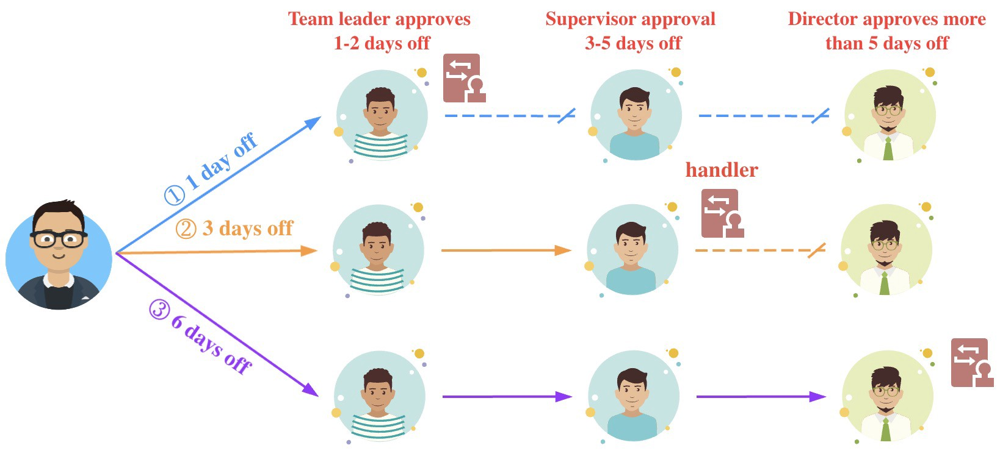
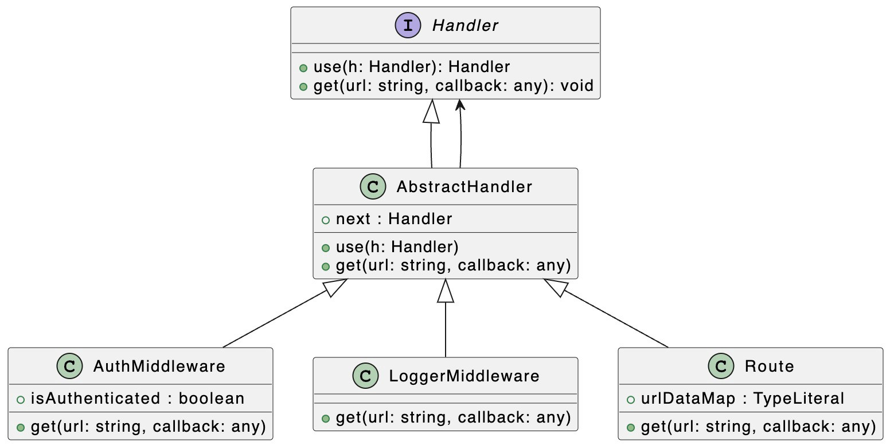
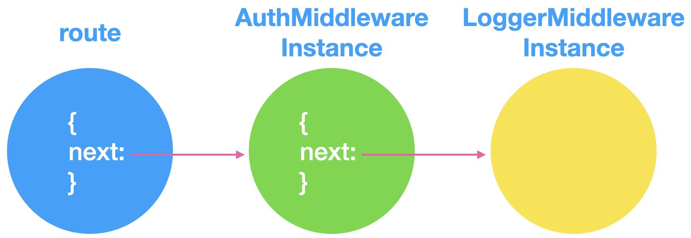
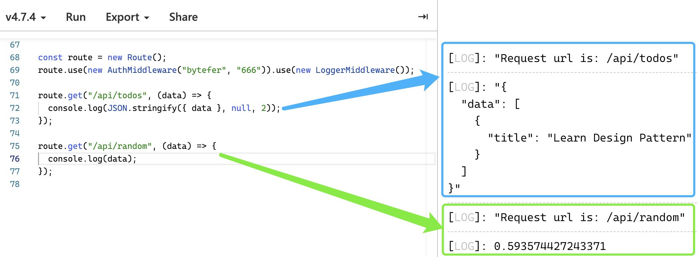

# Паттерны проектирования: паттерн Цепочка Обязанностей в TypeScript

[Источник](https://medium.com/javascript-in-plain-english/design-patterns-chain-of-responsibility-pattern-in-typescript-dba6bdffe456)


<br />

Добро пожаловать в серию **«Паттерны проектирования в TypeScript»**, в которой будет представлен ряд полезных паттернов проектирования в веб-разработке с использованием TypeScript.

Вот ссылки на опубликованные статьи:

- [Паттерн Стратегия в TypeScript](https://javascript.plainenglish.io/design-patterns-strategy-pattern-in-typescript-54eda9b40f09)
- [Паттерн Цепочка Обязанностей в TypeScript](https://javascript.plainenglish.io/design-patterns-chain-of-responsibility-pattern-in-typescript-dba6bdffe456)
- [Паттерн Наблюдатель в TypeScript](https://javascript.plainenglish.io/design-patterns-observer-pattern-in-typescript-f6589f1ce4fc)
- [Паттерн Шаблонного метода в TypeScript](https://javascript.plainenglish.io/design-patterns-template-method-pattern-in-typescript-ce0c8b158985)
- [Паттерн Адаптер в TypeScript](https://javascript.plainenglish.io/design-patterns-adapter-pattern-in-typescript-4b7ad3c1c234)
- [Паттерн Фабричного метода в TypeScript](https://javascript.plainenglish.io/design-patterns-factory-method-pattern-in-typescript-c4c3047a6289)
- [Паттерн Абстрактной фабрики в TypeScript](https://javascript.plainenglish.io/design-patterns-abstract-factory-pattern-in-typescript-84cd7b002964)

Паттерны проектирования очень важны для веб-разработчиков, которые освоив паттерны становятся способными улучшить качество написания кода. В этой статье я буду использовать **TypeScript**, чтобы рассказать о **паттерне Цепочка Обязанностей**.

Паттерн Цепочка Обязанностей — это способ избежать связи и взаимного влияния между отправителем и получателем запроса, предоставляя нескольким объектам возможность обрабатывать запрос. В паттерне Цепочка Обязанностей многочисленные объекты ссылаются последовательно друг на друга посредством ссылки от одного объекта к последующему объекту, чтобы сформировать цепочку. Запрос передаются по цепочке до тех пор, пока один из объектов в цепочке не осуществит обработку этого запроса.


<br />

Возьмем, к примеру, согласование отпуска в нашей компании: когда я прошу выходной, его нужно только утвердить тимлидом, и нет необходимости передавать его вышестоящему руководителю и директору. Разные должности в компании имеют разные обязанности и полномочия. Если звено в Цепочке Обязанностей не может обработать текущий запрос и в цепочке имеется следующее звено – то запрос будет перенаправлен на это последующее звено для обработки.

В процессе разработки программного обеспечения для Цепочки Обязанностей распространенным сценарием применения является мидлваре. Давайте посмотрим, как Цепочку Обязанностей используют для обработки запросов.

Чтобы лучше понять последующий код, необходимо сначала необходимо сначала внимательно рассмотреть диаграмму UML, описывающую этот код:


<br />

На приведенном выше рисунке мы определяем интерфейс `Handler`. Этот интерфейс в свою очередь определяет следующие два метода:

- **use(h: Handler): Handler** => Используется для регистрации обработчика (мидлваре)
- **get(url: string, callback: (data: any) => void): void** => Регистрирует обработчик запроса на получение

**Интерфейс обработчика**

```
interface Handler {
  use(h: Handler): Handler;
  get(url: string, callback: (data: any) => void): void;
}
```

Затем мы определим абстрактный класс `AbstractHandler`, который инкапсулирует логику обработки Цепочки Обязанностей. Другими словами, этот абстрактный класс соединяет обработчики, чтобы сформировать цепочку последовательных ссылок. <br/>**Абстрактный класс AbstractHandler**

```
abstract class AbstractHandler implements Handler {
  next!: Handler;
  use(h: Handler) {
    this.next = h;
    return this.next;
  }
  get(url: string, callback: (data: any) => void) {
    if (this.next) {
      return this.next.get(url, callback);
    }
  }
}
```

На основе абстрактного класса `AbstractHandler` мы определяем классы `AuthMiddleware` и `LoggerMiddleware`. Мидлваре `AuthMiddleware` используется для обработки аутентификации пользователей, а мидлваре `LoggerMidddleware` используется для вывода журналов запросов.

**Класс AuthMiddleware**

```
class AuthMiddleware extends AbstractHandler {
  isAuthenticated: boolean;
  constructor(username: string, password: string) {
    super();
    this.isAuthenticated = false;
    if (username === "bytefer" && password === "666") {
      this.isAuthenticated = true;
    }
  }
  get(url: string, callback: (data: any) => void) {
    if (this.isAuthenticated) {
      return super.get(url, callback);
    } else {
      throw new Error("Not Authorized");
    }
  }
}
```

**Класс LoggerMiddleware**

```
class LoggerMiddleware extends AbstractHandler {
  get(url: string, callback: (data: any) => void) {
    console.log(`Request url is: ${url}`);
    return super.get(url, callback);
  }
}
```

Вместе с классами `AuthMiddleware` и `LoggerMiddleware` давайте определим класс Route для регистрации созданных мидлваре.

**Класс Route**

```
class Route extends AbstractHandler {
  urlDataMap: { [key: string]: any };
  constructor() {
    super();
    this.urlDataMap = {
      "/api/todos": [
        { title: "Learn Design Pattern" },
      ],
      "/api/random": () => Math.random(),
    };
  }
 get(url: string, callback: (data: any) => void) {
    super.get(url, callback);
  if (this.urlDataMap.hasOwnProperty(url)) {
      const value = this.urlDataMap[url];
      const result = typeof value === "function" ? value() : value;
      callback(result);
    }
  }
}
```

После определения класса `Route` мы можем использовать его для регистрации имеющихся мидлваре следующим образом:

```
const route = new Route();
route.use(new AuthMiddleware("bytefer", "666"))
 .use(new LoggerMiddleware());
route.get("/api/todos", (data) => {
  console.log(JSON.stringify({ data }, null, 2));
});
route.get("/api/random", (data) => {
  console.log(data);
});
```

 <br /> Когда вы запустите приведенный выше код, вы получите соответствующий ему вывод, показанный ниже на рисунке:  <br />

Итак, подытожим сценарии использования паттерна Цепочка Обязанностей:

- Когда системе необходимо отправить запрос одному из нескольких объектов без явного указания получателя.
- Когда есть несколько объектов, которые могут обрабатывать запрос, и какой именно объект обрабатывает запрос, автоматически будет определятся только уже во время выполнения - клиенту нужно только отправить запрос в цепочку. <br />Если у вас есть какие-либо вопросы, пожалуйста, пишите мне. В дальнейшем я продолжу знакомить вас с другими паттернами, и если вам интересно, подпишитесь на меня в Medium или Twitter.
