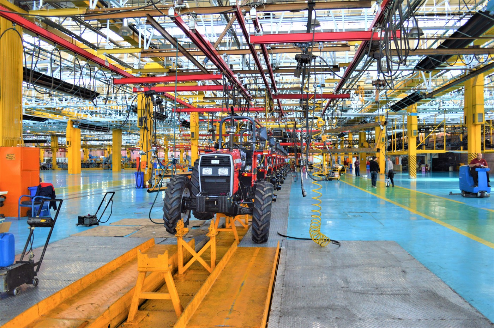
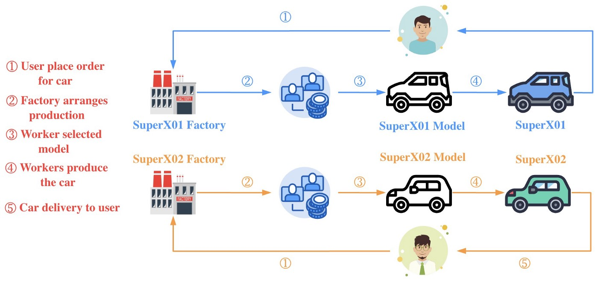
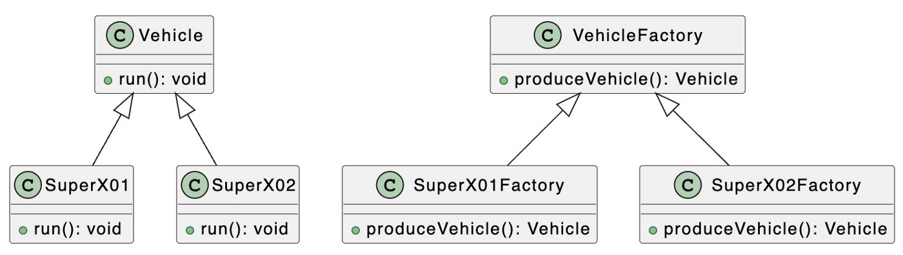

# Паттерны проектирования: паттерн Фабричного метода в TypeScript

### Освойте паттерн Фабричного метода и создавайте объекты с легкостью.

[Источник](https://medium.com/javascript-in-plain-english/design-patterns-factory-method-pattern-in-typescript-c4c3047a6289)


<br />

Добро пожаловать в серию **«Паттерны проектирования в TypeScript»**, в которой будет представлен ряд полезных паттернов проектирования в веб-разработке с использованием TypeScript.

Вот ссылки на опубликованные статьи:

- [Паттерн Стратегия в TypeScript](https://javascript.plainenglish.io/design-patterns-strategy-pattern-in-typescript-54eda9b40f09)
- [Паттерн Цепочка Обязанностей в TypeScript](https://javascript.plainenglish.io/design-patterns-chain-of-responsibility-pattern-in-typescript-dba6bdffe456)
- [Паттерн Наблюдатель в TypeScript](https://javascript.plainenglish.io/design-patterns-observer-pattern-in-typescript-f6589f1ce4fc)
- [Паттерн Шаблонного метода в TypeScript](https://javascript.plainenglish.io/design-patterns-template-method-pattern-in-typescript-ce0c8b158985)
- [Паттерн Адаптер в TypeScript](https://javascript.plainenglish.io/design-patterns-adapter-pattern-in-typescript-4b7ad3c1c234)
- [Паттерн Фабричного метода в TypeScript](https://javascript.plainenglish.io/design-patterns-factory-method-pattern-in-typescript-c4c3047a6289)
- [Паттерн Абстрактной фабрики в TypeScript](https://javascript.plainenglish.io/design-patterns-abstract-factory-pattern-in-typescript-84cd7b002964)

Паттерны проектирования очень важны для веб-разработчиков, которые освоив паттерны становятся способными улучшить качество написания кода. В этой статье я буду использовать **TypeScript**, чтобы рассказать о **паттерне Фабричного метода**.

Паттерн Фабричного метода, также известный как паттерн Фабрики, иногда еще называют полиморфным фабричным паттерном, который в свою очередь относится к порождающим паттернам.

В паттерне Фабричного метода родительский класс фабрики отвечает за определение публичного интерфейса для создания продуктовых объектов, а подкласс фабрики отвечает за создание специфических продуктовых объектов. **Цель этого состоит в том, чтобы оставить создание специфических свойств продукта подклассу фабрики**. То есть именно в подклассе фабрики определить, какой конкретный класс продукта должен быть создан.


<br />

На картинке выше я смоделировал процесс покупки автомобиля пользователем. Bytefer и Chris1993 заказали модели SuperX01 и SuperX02 на фабриках SuperX01 и SuperX02 соответственно, а затем фабрика произвела соответствующие модели и доставила их пользователям после завершения производства.

Давайте посмотрим, как можно использовать Паттерн Фабрики для описания процесса производства конкретной модели автомобиля на автомобильном заводе.

Чтобы лучше понять последующий код, давайте сначала внимательно изучим соответствующую диаграмму UML:


<br />

Паттерн Фабричного метода включает следующие роли:

- **Product (Vehicle)**: абстрактный продукт
- **Concrete Product (SuperX01)**: конкретный продукт
- **Factory (VehicleFactory)**: абстрактная фабрика
- **ConcreteFactory(SuperX01Factory)**: конкретная фабрика

Затем мы определяем абстрактный класс `Vehicle` и два его подкласса `SuperX01` и `SuperX02` для конкретных двух различных типов транспортных средств.

```
abstract class Vehicle {
  abstract run(): void;
}
class SuperX01 extends Vehicle {
  run(): void {
    console.log("SuperX01 start");
  }
}
class SuperX02 extends Vehicle {
  run(): void {
    console.log("SuperX02 start");
  }
}
```

Затем мы определяем класс `VehicleFactory` для представления завода по производству автомобилей. **Абстрактный класс содержит абстрактный метод `produceVehicle`, который является так называемым фабричным методом**.

```
abstract class VehicleFactory {
  abstract produceVehicle(): Vehicle;
}
```

На основе абстрактного класса `VehicleFactory` мы определяем фабричные классы `SuperX01Factory` и `SuperX02Factory` для производства моделей автомобилей **SuperX01** и **SuperX02**:

```
class SuperX01Factory extends VehicleFactory {
  produceVehicle(): Vehicle {
    return new SuperX01();
  }
}
class SuperX02Factory extends VehicleFactory {
  produceVehicle(): Vehicle {
    return new SuperX02();
  }
}
```

После создания фабричных классов `SuperX01Factory` и `SuperX02Factory` мы можем начать производить автомобили:

```
const superX01Factory = new SuperX01Factory();
const superX02Factory = new SuperX02Factory();
const superX01Vehicle = superX01Factory.produceVehicle();
const superX02Vehicle = superX02Factory.produceVehicle();
superX01Vehicle.run();
superX02Vehicle.run();
```

Если запустить приведенный выше код, то в терминале вы увидите следующий результат:

```
SuperX01 start
SuperX02 start
```

Итак, давайте подведем итоги и определим сценарии использования паттерна Фабричного метода:

- В паттерне Фабричного метода абстрактный фабричный класс должен только предоставить интерфейс для создания продуктов, а его подклассы определяют конкретные создаваемые объекты. Используя объектно-ориентированный полиморфизм и принцип подстановки Лисков, в ходе работы программы, объекты подкласса переопределяют объекты родительского класса, делая расширение системы более простой задачей. <br />

Если у вас есть какие-либо вопросы, пожалуйста, пишите мне. В дальнейшем я продолжу знакомить вас с другими паттернами, и если вам интересно, подпишитесь на меня в Medium или Twitter.
