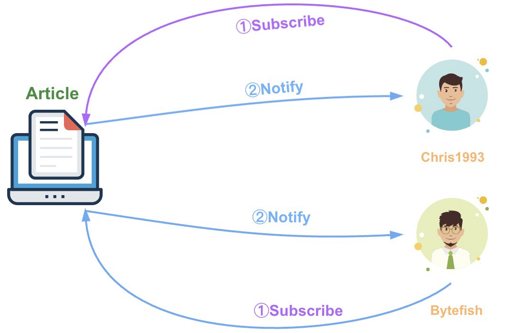
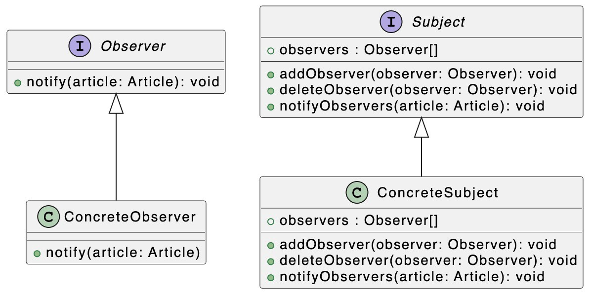
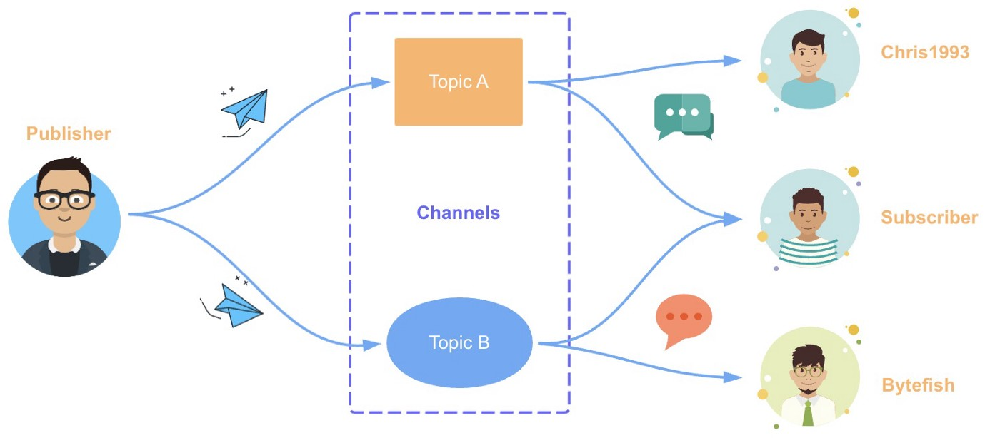

# Паттерны проектирования: паттерн Наблюдатель в TypeScript

### Осваиваем сценарии реализации и применения паттерна Наблюдатель и паттерна Издатель-Подписчик.

[Источник](https://javascript.plainenglish.io/design-patterns-observer-pattern-in-typescript-f6589f1ce4fc)


<br />

Добро пожаловать в серию **«Паттерны проектирования в TypeScript»**, в которой будет представлен ряд полезных паттернов проектирования в веб-разработке с использованием TypeScript.

Вот ссылки на опубликованные статьи:

- [Паттерн Стратегия в TypeScript](https://javascript.plainenglish.io/design-patterns-strategy-pattern-in-typescript-54eda9b40f09)
- [Паттерн Цепочка Обязанностей в TypeScript](https://javascript.plainenglish.io/design-patterns-chain-of-responsibility-pattern-in-typescript-dba6bdffe456)
- [Паттерн Наблюдатель в TypeScript](https://javascript.plainenglish.io/design-patterns-observer-pattern-in-typescript-f6589f1ce4fc)
- [Паттерн Шаблонного метода в TypeScript](https://javascript.plainenglish.io/design-patterns-template-method-pattern-in-typescript-ce0c8b158985)
- [Паттерн Адаптер в TypeScript](https://javascript.plainenglish.io/design-patterns-adapter-pattern-in-typescript-4b7ad3c1c234)
- [Паттерн Фабричного метода в TypeScript](https://javascript.plainenglish.io/design-patterns-factory-method-pattern-in-typescript-c4c3047a6289)
- [Паттерн Абстрактной фабрики в TypeScript](https://javascript.plainenglish.io/design-patterns-abstract-factory-pattern-in-typescript-84cd7b002964)

Паттерны проектирования очень важны для веб-разработчиков, которые освоив паттерны становятся способными улучшить качество написания кода. В этой статье я буду использовать TypeScript, чтобы представить **Паттерн Наблюдатель** и **Паттерн Издатель-Подписчик**.

## Паттерн Наблюдатель

Паттерн Наблюдатель (Observer) широко используется в веб-приложениях - `MutationObserver`, `IntersectionObserver`, `PerformanceObserver`, `ResizeObserver`, `ReportingObserver`. Все эти API можно рассмотреть как примеры Паттерна Наблюдатель. Кроме того, этот паттерн также используется для мониторинга событий и реагирования на мутации данных (например, при изменении данных и автоматическом обновлении страницы). <br /> Паттерн Наблюдатель определяет отношение **«один ко многим»**, и этим позволяет нескольким объектам-наблюдателям одновременно отслеживать наблюдаемый субъект. При изменении состояния наблюдаемого субъекта все объекты-наблюдатели будут уведомлены о таком изменении, чтобы они в свою очередь могли автоматически обновить свое состояние. В Паттерне Наблюдатель есть две основные роли: **Субъект и Наблюдатель**.


<br />

На диаграмме выше в качестве Субъекта выступает моя статья (Article), а Наблюдателями являются Chris1993 и Bytefish. Паттерн Наблюдатель поддерживает простейшую связь в режиме широковещательной передачи, и поэтому все наблюдатели автоматически уведомляются о публикации новой статьи. Чтобы лучше понять дальнейший код, давайте сначала изучим соответствующую ему диаграмму UML:


<br />

На приведенном выше рисунке мы с помощью механизмов `интерфейса` определяем непосредственно интерфейс `Observer` и интерфейс `Subject` соответственно, которые используются для описания объектов **Observer** и **Subject**. **Observer интерфейс**

```
interface Observer {
  notify(article: Article): void;
}
```

**Subject интерфейс**

```
interface Subject {
  observers: Observer[];
  addObserver(observer: Observer): void;
  deleteObserver(observer: Observer): void;
  notifyObservers(article: Article): void;
}
```

Затем мы определяем классы `ConcreteObserver` и `ConcreteSubject`, в которых реализуются вышеуказанные интерфейсы: <br />**ConcreteObserver класс**

```
class ConcreteObserver implements Observer {
  constructor(private name: string) {}
  notify(article: Article) {
    console.log(`"Article: ${article.title}" has been sent to  ${this.name}.`);
  }
}
```

<br />**ConcreteSubject класс**

```
class ConcreteSubject implements Subject{
  public observers: Observer[] = [];
  public addObserver(observer: Observer): void {
    this.observers.push(observer);
  }
  public deleteObserver(observer: Observer): void {
    const n: number = this.observers.indexOf(observer);
    n != -1 && this.observers.splice(n, 1);
  }
  public notifyObservers(article: Article): void {
    this.observers.forEach((observer) => observer.notify(article));
  }
}
```

Давайте проверим работу функций в наших классах на примере вот таких команд:

```
const subject: Subject = new ConcreteSubject();
const chris1993 = new ConcreteObserver("Chris1993");
const bytefish = new ConcreteObserver("Bytefish");
subject.addObserver(chris1993);
subject.addObserver(bytefish);
subject.notifyObservers({
  author: "Bytefer",
  title: "Observer Pattern in TypeScript",
  url: "https://medium.com/***",
});
subject.deleteObserver(bytefish);
subject.notifyObservers({
  author: "Bytefer",
  title: "Adapter Pattern in TypeScript",
  url: "https://medium.com/***",
});
```

В результате выполнения вышеуказанного кода, терминал выведет такой результат:

```
"Article: Observer Pattern in TypeScript" has been sent to Chris1993.
"Article: Observer Pattern in TypeScript" has been sent to Bytefish.
"Article: Adapter Pattern in TypeScript" has been sent to Chris1993.
```

Представим, что в настоящее время я пишу на две основные тематики - JavaScript и TypeScript. Поэтому, если я захочу опубликовать новую статью, то об этом необходимо уведомить только читателей, интересующихся JavaScript, или только читателей, интересующихся TypeScript. Если мы используем Паттерн Наблюдатель, нам следует создать два разных Субъекта. Но с другой стороны можно поменять решение и использовать **паттерн Издатель-Подписчик**.

<br />**Паттерн Издатель-Подписчик** <br />

В архитектуре программного обеспечения Издатель-Подписчик — это парадигма обмена сообщениями, в которой отправители сообщений (называемые издателями) не отправляют сообщения напрямую конкретным получателям (называемые подписчиками). Вместо этого опубликованные сообщения группируются по разным категориям и отправляются к разным подписчикам. Аналогичным образом подписчики могут интересоваться одной или нескольким категориями сообщений и получать только такие интересующие их сообщения, не зная о существовании издателей. <br />В паттерне Издатель-Подписчик есть три основные роли: Издатели, Каналы и Подписчики.

 <br /> На приведенном выше рисунке Издатель — это Bytefer, тема A и тема B в Каналах соответствуют теме JavaScript и теме TypeScript соответственно, а Подписчики — Chris1993, Bytefish и т. д. Давайте реализуем класс EventEmitter на основе паттерна Издатель-Подписчик:

```

type EventHandler = (...args: any[]) => any;

class EventEmitter {
  private c = new Map<string, EventHandler[]>();

  subscribe(topic: string, ...handlers: EventHandler[]) {
    let topics = this.c.get(topic);
    if (!topics) {
      this.c.set(topic, (topics = []));
    }
    topics.push(...handlers);
  }

  unsubscribe(topic: string, handler?: EventHandler): boolean {
    if (!handler) {
      return this.c.delete(topic);
    }

    const topics = this.c.get(topic);
    if (!topics) {
      return false;
    }

    const index = topics.indexOf(handler);

    if (index < 0) {
      return false;
    }
    topics.splice(index, 1);
    if (topics.length === 0) {
      this.c.delete(topic);
    }
    return true;
  }

  publish(topic: string, ...args: any[]): any[] | null {
    const topics = this.c.get(topic);
    if (!topics) {
      return null;
    }
    return topics.map((handler) => {
      try {
        return handler(...args);
      } catch (e) {
        console.error(e);
        return null;
      }
    });
  }
}
```

[event-emitter.ts hosted by GitHub ](https://gist.github.com/semlinker/b63d748636ef27a0d57dc6c4c251f720#file-event-emitter-ts)

После определения класса `EventEmitter` мы можем использовать его следующим образом:

```
const eventEmitter = new EventEmitter();
eventEmitter.subscribe("ts",
  (msg) => console.log(`Received：${msg}`));
eventEmitter.publish("ts", "Observer pattern");
eventEmitter.unsubscribe("ts");
eventEmitter.publish("ts", "Pub-Sub pattern");
```

Если запустить на исполнение вышеприведенный код то терминал выведет следующий результат: `Received: Observer pattern`.

<br />В событийно-ориентированной архитектуре паттерн Издатель-Подписчик играет важную роль. Конкретная реализация этого паттерна может использоваться в качестве шины событий для реализации обмена сообщениями между различными компонентами или модулями в одной системе. Для популярной архитектуры подключаемых модулей паттерн Издатель-Подписчик можно использовать для реализации обмена сообщениями между различными подключаемыми модулями.

<br />Надеюсь, после прочтения этой статьи у вас появилось определенное представление о паттерне Наблюдателя и паттерне Издатель-Подписчик. Если у вас есть какие-либо вопросы, пожалуйста, пишите мне. В дальнейшем я продолжу знакомить вас с другими паттернами, и если вам интересно, подпишитесь на меня в Medium или Twitter.
