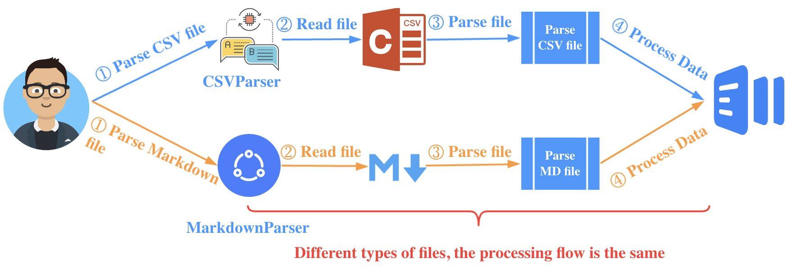
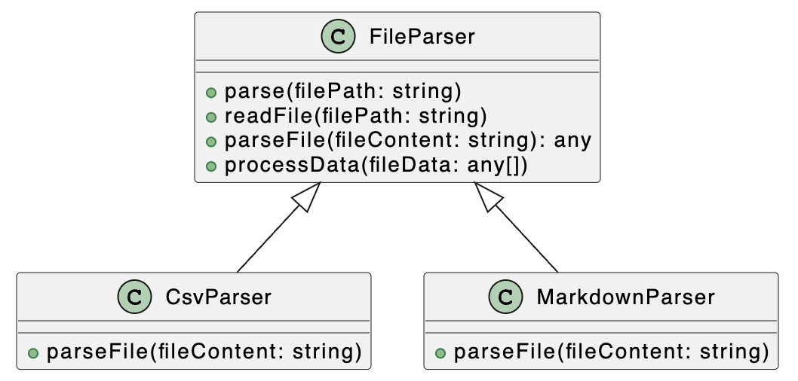
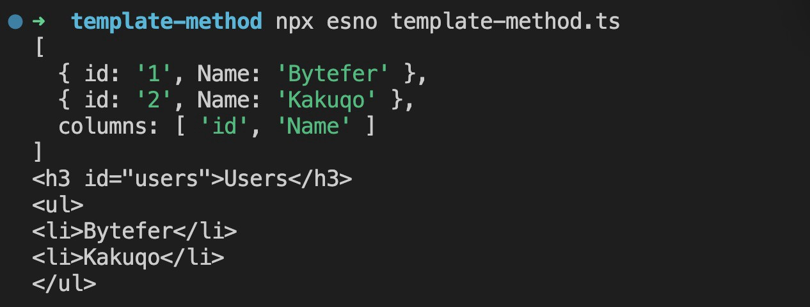

# Паттерны проектирования: паттерн Шаблонного метода в TypeScript

[Источник](https://medium.com/javascript-in-plain-english/design-patterns-template-method-pattern-in-typescript-ce0c8b158985)


<br />

Добро пожаловать в серию **«Паттерны проектирования в TypeScript»**, в которой будет представлен ряд полезных паттернов проектирования в веб-разработке с использованием TypeScript.

Вот ссылки на опубликованные статьи:

- [Паттерн Стратегия в TypeScript](https://javascript.plainenglish.io/design-patterns-strategy-pattern-in-typescript-54eda9b40f09)
- [Паттерн Цепочка Обязанностей в TypeScript](https://javascript.plainenglish.io/design-patterns-chain-of-responsibility-pattern-in-typescript-dba6bdffe456)
- [Паттерн Наблюдатель в TypeScript](https://javascript.plainenglish.io/design-patterns-observer-pattern-in-typescript-f6589f1ce4fc)
- [Паттерн Шаблонного метода в TypeScript](https://javascript.plainenglish.io/design-patterns-template-method-pattern-in-typescript-ce0c8b158985)
- [Паттерн Адаптер в TypeScript](https://javascript.plainenglish.io/design-patterns-adapter-pattern-in-typescript-4b7ad3c1c234)
- [Паттерн Фабричного метода в TypeScript](https://javascript.plainenglish.io/design-patterns-factory-method-pattern-in-typescript-c4c3047a6289)
- [Паттерн Абстрактной фабрики в TypeScript](https://javascript.plainenglish.io/design-patterns-abstract-factory-pattern-in-typescript-84cd7b002964)

Паттерны проектирования очень важны для веб-разработчиков, которые освоив паттерны становятся способными улучшить качество написания кода. В этой статье я буду использовать **TypeScript**, чтобы рассказать о **паттерне Шаблонного метода**.

CSV (значения, разделенные запятыми) — это относительно простой формат файла с данными. Файлы CSV хранят табличные данные (числа и текст) в виде обычного текста. Процесс обработки данных в формате CSV показан на следующем рисунке: <br />  <br /> Разобравшись с описанным выше процессом обработки, давайте воспользуемся Node.js для реализации функции анализа CSV-файлов.<br/> **users.csv**

```
id,Name
1,Bytefer
2,Kakuqo
```

**parse-csv.ts**

```
import fs from "fs";
import path from "path";
import * as url from "url";
import { csvParse } from "d3-dsv";
const __dirname = url.fileURLToPath(new URL(".", import.meta.url));
const processData = (fileData: any[]) => console.dir(fileData);
const content = fs.readFileSync(path.join(__dirname, "users.csv"), "utf8");
const fileData = csvParse(content);
processData(fileData);
```

В приведенном выше коде мы импортируем модуль `d3-dsv` для реализации функции парсинга csv. После этого мы используем `esno` для обработки файла **parse-cvs.ts**:<br/>

```
$ npx esno parse-csv.ts
```

Когда вы запустите приведенный выше код, на терминале будет получен следующий результат, показанный ниже на рисунке:

```
[
  { id: '1', Name: 'Bytefer' },
  { id: '2', Name: 'Kakuqo' },
  columns: [ 'id', 'Name' ]
]
```

Markdown — это малотребовательный язык разметки, который позволяет писать документы в простом текстовом формате, который легко читать и писать. Но для того, чтобы отобразить документы Markdown на веб-страницах, мы должны преобразовать Markdown-документ в HTML-документ.

Чтобы осуществить вышеописанный процесс построим процедуру обработки следующим образом: <br />  <br /> Разобравшись с описанной выше процедурой, давайте воспользуемся Node.js для реализации функции парсинга файлов Markdown.

**Users.md**

```
### Users
- Bytefer
- Kakuqo
```

**parse-md.ts**

```
import fs from "fs";
import path from "path";
import * as url from "url";
import { marked } from 'marked';
const __dirname = url.fileURLToPath(new URL(".", import.meta.url));
const processData = (fileData: any[]) => console.dir(fileData);
const content = fs.readFileSync(path.join(__dirname, "Users.md"), "utf8");
const fileData = marked.parse(content);
processData(fileData);
```

В приведенном выше коде мы импортируем `marked` модуль для реализации функции парсинга файла Markdown. После этого используем `esno` для обработки файла **parse-md.ts**:

```
$ npx esno parse-md.ts
```

После выполнения вышеуказанного кода терминал выведет следующий результат:

```
'<h3 id="users">Users</h3>\n<ul>\n<li>Bytefer</li>\n<li>Kakuqo</li>\n</ul>\n'
```

Несмотря на то, что в предыдущих двух примерах анализируются файлы разных типов, сам процесс анализа файлов аналогичен.<br />  <br />

Весь процесс состоит из трех основных шагов: **чтение файла, парсинг файла и обработка данных**. Для этой процедуры обработки файлов мы можем ввести паттерн Шаблонного метода, чтобы инкапсулировать последовательность обработки, состоящую из трех вышеуказанных шагов.

Паттерн Шаблонного метода состоит из двух частей: **абстрактного родительского класса и конкретного подкласса реализации**. Обычно структура алгоритма подкласса инкапсулируется в абстрактный родительский класс, который также включает в себя реализацию некоторых общедоступных методов и порядок выполнения всех методов в инкапсулированном подклассе. Наследуя этот абстрактный класс, подклассы также наследуют всю структуру алгоритма и могут переопределить методы родительского класса.

Теперь давайте посмотрим, как реализовать анализатор CSV и анализатор Markdown с использованием паттерна Шаблонного метода.

Чтобы лучше понять следующий код, давайте рассмотрим диаграмму UML, описывающую взаимные связи между классами: <br />  <br /> На приведенном выше рисунке мы определяем абстрактный класс `FileParser`, а затем определяем два подкласса реализации - `CsvParser` и `MarkdownParser`.<br /> **Класс FileParser**

```
abstract class FileParser {
  // Template Method
  parse(filePath: string) {
    let content = this.readFile(filePath);
    let fileData = this.parseFile(content);
    this.processData(fileData);
  }
  readFile(filePath: string) {
    if (fs.existsSync(filePath)) {
      return fs.readFileSync(filePath, "utf8");
    }
  }
  abstract parseFile(fileContent: string): any;
  processData(fileData: any[]) {
    console.log(fileData);
  }
}
```

Метод `parse` в абстрактном классе `FileParser` — это так называемый шаблонный метод, в который мы будем инкапсулировать один из процессов обработки файла. <br /> **Класс CsvParser**

```
class CsvParser extends FileParser {
  parseFile(fileContent: string) {
    return csvParse(fileContent);
  }
}
```

<br /> **Класс MarkdownParser**

```
class MarkdownParser extends FileParser {
  parseFile(fileContent: string) {
    return marked.parse(fileContent);
  }
}
```

С помощью этих двух классов `CsvParser` и `MarkdownParser` мы можем анализировать файлы CSV и Markdown следующим кодом: <br />

```
const csvParser = new CsvParser();
csvParser.parse(path.join(__dirname, "Users.csv"));
const mdParser = new MarkdownParser();
mdParser.parse(path.join(__dirname, "Users.md"));
```

После запуска этого кода вы получите следующий результат: <br />  <br />

Используя паттерн Шаблонного метода, мы переиспользуем код парсинга файлов CSV и Markdown. Более того, с помощью абстрактного класса `FileParser` мы можем легко разрабатывать новые различные парсеры для других типов файлов.

Итак, давайте подытожим сценарии использования паттерна Шаблонного метода:

- Если общие шаги алгоритма постоянны, но некоторые части (шаги) алгоритма являются различными по своей внутренней реализации, то паттерн Шаблонного метода удобно использовать для абстрагирования от таких варьируемых частей алгоритма для реализации внутри отдельных подклассов. <br />

Если у вас есть какие-либо вопросы, пожалуйста, пишите мне. В дальнейшем я продолжу знакомить вас с другими паттернами, и если вам интересно, подпишитесь на меня в Medium или Twitter.
